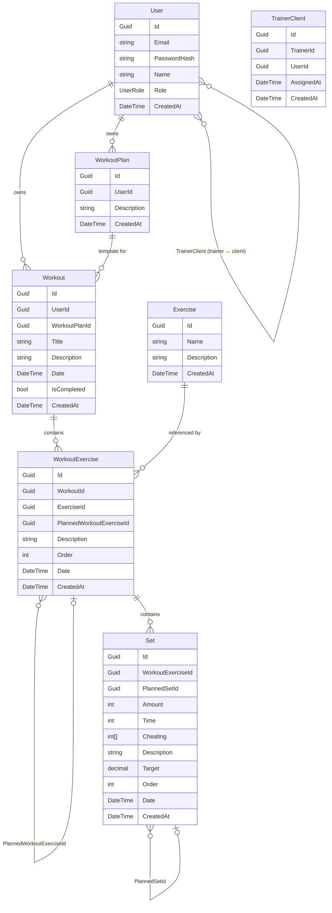

# Data Layer — Entities

Documentation for the GymApi project entities (DataLayer).

---

## Entity Relationship Diagram



---

## Planned vs. Actual Concept

A single `Workout` holds both **planned** and **actual** data.
The distinction is made at the `WorkoutExercise` and `Set` level via the `Date` field:

| `Date` value | Meaning |
|---|---|
| `null` | Planned record (template) |
| Date/time value | Actually performed record |

The relationship between a planned record and its actual counterpart is established via **self-references**:

- `WorkoutExercise.PlannedWorkoutExerciseId` → points to the planned `WorkoutExercise`
- `Set.PlannedSetId` → points to the planned `Set`

---

## BaseEntity

**File:** `DataLayer/Entities/BaseEntity.cs`

Abstract base class inherited by all entities.

| Field | Type | Description |
|---|---|---|
| `Id` | `Guid` | Unique record identifier (PK) |
| `CreatedAt` | `DateTime` | Date and time the record was created |

---

## User

**File:** `DataLayer/Entities/UserEntity.cs`

A system user. Can be a regular user, a trainer, or an administrator.

| Field | Type | Nullable | Description |
|---|---|---|---|
| `Id` | `Guid` | — | Inherited from `BaseEntity` |
| `Email` | `string` | — | Email address (unique) |
| `PasswordHash` | `string` | — | BCrypt password hash |
| `Name` | `string` | — | User's display name |
| `Role` | `UserRole` | — | Role: `User (0)`, `Trainer (1)`, `Admin (2)` |
| `CreatedAt` | `DateTime` | — | Inherited from `BaseEntity` |

**Navigation properties:**

| Property | Type | Description |
|---|---|---|
| `WorkoutPlans` | `ICollection<WorkoutPlanEntity>` | Workout plans owned by the user |
| `Workouts` | `ICollection<WorkoutEntity>` | Workouts owned by the user |
| `TrainerAssignments` | `ICollection<TrainerClientEntity>` | Records where this user acts as the trainer |
| `ClientAssignments` | `ICollection<TrainerClientEntity>` | Records where this user acts as the client |

### UserRole (enum)

```csharp
public enum UserRole : byte
{
    User    = 0,
    Trainer = 1,
    Admin   = 2,
}
```

---

## WorkoutPlan

**File:** `DataLayer/Entities/WorkoutPlanEntity.cs`

A workout program (template) belonging to a user. Contains a description and can be linked to multiple `Workout` records.

| Field | Type | Nullable | Description |
|---|---|---|---|
| `Id` | `Guid` | — | Inherited from `BaseEntity` |
| `UserId` | `Guid` | — | FK → `User` |
| `Description` | `string` | — | Plan description |
| `CreatedAt` | `DateTime` | — | Inherited from `BaseEntity` |

**Navigation properties:**

| Property | Type | Description |
|---|---|---|
| `User` | `UserEntity` | Owner of the plan |
| `Workouts` | `ICollection<WorkoutEntity>` | Workouts created from this plan |

---

## Workout

**File:** `DataLayer/Entities/WorkoutEntity.cs`

A user's workout session. Can be linked to a `WorkoutPlan`. Contains both planned and actual exercises.

| Field | Type | Nullable | Description |
|---|---|---|---|
| `Id` | `Guid` | — | Inherited from `BaseEntity` |
| `UserId` | `Guid` | — | FK → `User` |
| `WorkoutPlanId` | `Guid?` | ✓ | FK → `WorkoutPlan` (optional) |
| `Title` | `string?` | ✓ | Workout title |
| `Description` | `string` | — | Workout description |
| `Date` | `DateTime` | — | Workout date (defaults to `DateTime.Now`) |
| `IsCompleted` | `bool` | — | Completion flag (defaults to `false`) |
| `CreatedAt` | `DateTime` | — | Inherited from `BaseEntity` |

**Navigation properties:**

| Property | Type | Description |
|---|---|---|
| `User` | `UserEntity` | Owner of the workout |
| `WorkoutPlan` | `WorkoutPlanEntity?` | Linked plan (if any) |
| `WorkoutExercises` | `ICollection<WorkoutExerciseEntity>` | Exercises in the workout |

---

## WorkoutExercise

**File:** `DataLayer/Entities/WorkoutExerciseEntity.cs`

An exercise entry within a workout. Supports a self-reference to link planned → actual records.

| Field | Type | Nullable | Description |
|---|---|---|---|
| `Id` | `Guid` | — | Inherited from `BaseEntity` |
| `WorkoutId` | `Guid` | — | FK → `Workout` |
| `ExerciseId` | `Guid` | — | FK → `Exercise` |
| `PlannedWorkoutExerciseId` | `Guid?` | ✓ | FK → `WorkoutExercise` (the planned exercise) |
| `Description` | `string` | — | Notes / description |
| `Order` | `int` | — | Position within the workout |
| `Date` | `DateTime?` | ✓ | `null` = planned, value = actual |
| `CreatedAt` | `DateTime` | — | Inherited from `BaseEntity` |

**Navigation properties:**

| Property | Type | Description |
|---|---|---|
| `Workout` | `WorkoutEntity` | The workout this exercise belongs to |
| `Exercise` | `ExerciseEntity` | Reference to the exercise catalog |
| `PlannedWorkoutExercise` | `WorkoutExerciseEntity?` | The planned exercise (self-reference) |
| `Sets` | `ICollection<SetEntity>` | Sets for this exercise |

> **Note:** `DeleteBehavior.Restrict` on the self-reference — a planned exercise cannot be deleted while actual exercises still reference it.

---

## Set

**File:** `DataLayer/Entities/SetEntity.cs`

A single set within an exercise entry. Supports a self-reference to link planned → actual records.

| Field | Type | Nullable | Description |
|---|---|---|---|
| `Id` | `Guid` | — | Inherited from `BaseEntity` |
| `WorkoutExerciseId` | `Guid` | — | FK → `WorkoutExercise` |
| `PlannedSetId` | `Guid?` | ✓ | FK → `Set` (the planned set) |
| `Amount` | `int` | — | Number of repetitions (defaults to `0`) |
| `Time` | `int?` | ✓ | Duration in seconds |
| `Cheating` | `int[]?` | ✓ | Array of cheating rep values |
| `Description` | `string` | — | Notes / description |
| `Target` | `decimal?` | ✓ | Target weight or other metric |
| `Order` | `int` | — | Position within the exercise |
| `Date` | `DateTime?` | ✓ | `null` = planned, value = actual |
| `CreatedAt` | `DateTime` | — | Inherited from `BaseEntity` |

**Navigation properties:**

| Property | Type | Description |
|---|---|---|
| `WorkoutExercise` | `WorkoutExerciseEntity` | The exercise entry this set belongs to |
| `PlannedSet` | `SetEntity?` | The planned set (self-reference) |

> **Note:** `DeleteBehavior.Restrict` on the self-reference — a planned set cannot be deleted while actual sets still reference it.

---

## Exercise

**File:** `DataLayer/Entities/ExerciseEntity.cs`

Exercise catalog. A global list of available exercises.

| Field | Type | Nullable | Description |
|---|---|---|---|
| `Id` | `Guid` | — | Inherited from `BaseEntity` |
| `Name` | `string` | — | Exercise name |
| `Description` | `string?` | ✓ | Exercise description |
| `CreatedAt` | `DateTime` | — | Inherited from `BaseEntity` |

**Navigation properties:**

| Property | Type | Description |
|---|---|---|
| `WorkoutExercises` | `ICollection<WorkoutExerciseEntity>` | All workout entries using this exercise |

---

## TrainerClient

**File:** `DataLayer/Entities/TrainerClientEntity.cs`

A join entity linking a trainer to a client. Both participants are system users with different roles.

| Field | Type | Nullable | Description |
|---|---|---|---|
| `Id` | `Guid` | — | Inherited from `BaseEntity` |
| `TrainerId` | `Guid` | — | FK → `User` (trainer) |
| `UserId` | `Guid` | — | FK → `User` (client) |
| `AssignedAt` | `DateTime` | — | Date of assignment |
| `CreatedAt` | `DateTime` | — | Inherited from `BaseEntity` |

**Navigation properties:**

| Property | Type | Description |
|---|---|---|
| `Trainer` | `UserEntity` | Reference to the trainer user |
| `Client` | `UserEntity` | Reference to the client user |
